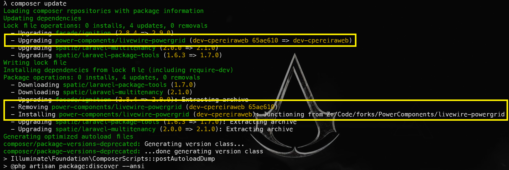

<div align="center">
	<p></p>
</div>

------

# Como contribuir com o PowerGrid

O objetivo desse documento é facilitar a colaboração com [PowerGrid](https://github.com/Power-Components/livewire-powergrid).

## 1) Fazer o fork do projeto
Para isso, basta acessar a página do nosso repositório em [PowerGrid](https://github.com/Power-Components/livewire-powergrid) e clicar no botão *Fork*:<br />
<br />
No final você terá algo como https://github.com/cpereiraweb/livewire-powergrid.<br />
Obs: Se você estiver associado à uma equipe ou organização no Github, você deverá confirmar em qual conta você deseja criar o fork.

## 2) Clonar o repositório em sua máquina
Selecione uma pasta em seu computador para fazer o fork do projeto:<br />


## 3) Crie um novo branch e faça o push para seu repositório
Acesse o diretório do repositório:
```bash
cd livewire-powergrid
```
Crie um novo branch (usei o meu nome de usuário aqui para exemplificar):
```bash
git checkout -b cpereiraweb
```
Você precisa fazer o push desse branch para o seu servidor.  Como sugestão, crie um arquivo TODO.md na raiz do projeto, adicione-o e faça o commit:
```bash
touch TODO.md
git add .
git commit -m "Added TODO.md"
git push origin cpereiraweb  # Use o nome do seu branch aqui, ok?
```
## 4) Adicione o PowerGrid ao seu projeto Laravel
Acesse a pasta do seu projeto Laravel e faça a instalação do componente, como descrito na documentação:
```bash
composer require power-components/livewire-powergrid
```
## 5) Configure o ```composer``` para usar o seu clone do PowerGrid
Você vai precisar informar ao `composer` duas coisas: que quer usar uma versão de desenvolvimento do pacote e onde está essa versão.  Isso é simples:
Abra o `composer.json` e identifique a linha de requisição do PowerGrid:
```json
"power-components/livewire-powergrid": "^1.0",
```
Tomando por base o que eu fiz até aqui, vou configurar a versão.  Ela deve ser `dev-`+`o-nome-do-meu-branch`.  No meu caso, `dev-cpereiraweb`:
```json
"power-components/livewire-powergrid": "dev-cpereiraweb",
```
O segundo passo é informar onde está esse repositório. Para isso acrescentamos a seção `repositories` ao nosso `composer.json`.  
Há pelo menos duas maneiras de fazer isso: usando a URL do seu repositório no Github ou indicar o caminho dele na sua máquina.

Veja o trecho abaixo para usar o repositório no Github:
```json
        ...
        "spatie/laravel-ray": "^1.17",
        "wulfheart/pretty_routes": "^0.2.0"
    },
    "repositories": [
        {
            "type": "vcs",
            "url": "https://github.com/cpereiraweb/livewire-powergrid.git"
        }
    ],
    "autoload": {
        ...
```

E agora veja como fica usando o caminho do seu repositório local (onde você o clonou).  No meu caso, a pasta onde clonei o repositório localmente é `Z:\Code\forks\PowerComponents\livewire-powergrid`:
```json
        ...
        "spatie/laravel-ray": "^1.17",
        "wulfheart/pretty_routes": "^0.2.0"
    },
    "repositories": [
        {
            "type": "path",
            "url": "Z:\\Code\\forks\\PowerComponents\\livewire-powergrid"
        }
    ],
    "autoload": {
        ...
```
*Observação: meu ambiente é Windows 10.  Se você usa `WSL`, `Docker`, `Linux` ou `MacOS`, lembre-se de usar o caminho adequado ao seu sistema, que deve ser algo como `/home/cpereiraweb/code/forks/PowerComponents/livewire-powergrid`, por exemplo.*<br />

## 6) Executar o `composer update`
Agora é só rodar o comando `composer update` no seu projeto Laravel para ele atualizar as referências.  Veja o resultado abaixo (usando o link do seu repositório no Github):<br />&nbsp;<br />
<br />&nbsp;<br />
A imagem mostra o uso dos commits do meu repositório.  Eu havia instalado primeiramente o commit `219cdd8`.  Na imagem acima, foi atualizado para o commit `65ae610`.<br />&nbsp;<br />

Mas se você configurou para usar o `repositório localmente`, o resultado será esse:<br />&nbsp;<br />
<br />&nbsp;<br />
Você pode observar acima que ele remove a versão Github do meu repositório e instala a versão local.  Com isso, as indicações do commit desaparecem.  Desta maneira eu não preciso mais fazer `push` do meu fork nem `composer update` no meu projeto Laravel, tornando o processo mais dinâmico.

## Tudo pronto!
Agora é só seguir o fluxo de qualquer projeto Git: faça as alterações no seu fork e faça o push para o Github.  No diretório do seu projeto Laravel, rode o `composer update` para atualizar o código no seu projeto. Sem POG(Programação Orientada à Gambiarras)!  Grande abraço!
